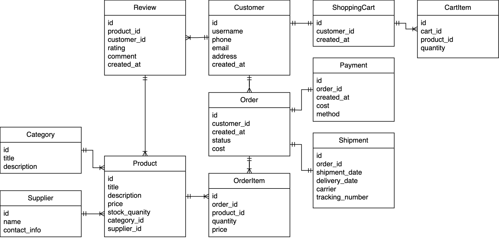
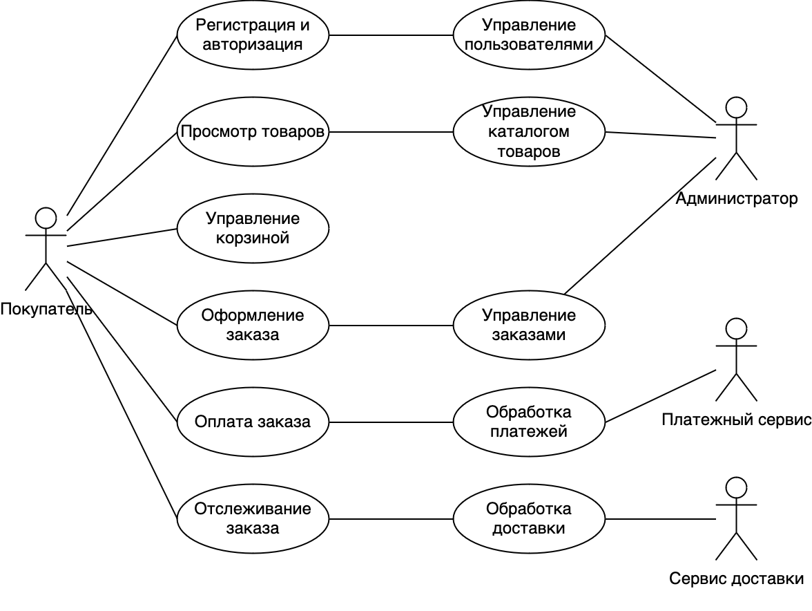
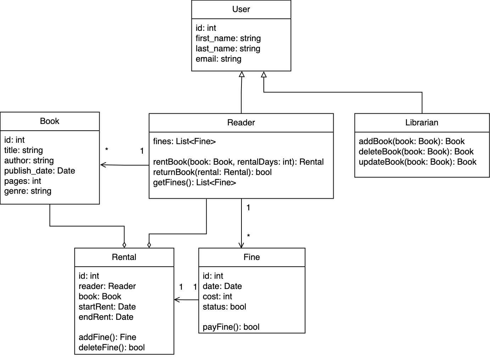

# Продумать полный жизненный цикл проекта по понравившейся методологии разработки
## Agile
1. Инициация проекта

На этом этапе команда собирается для того, чтобы обсудить основные цели проекта и его масштаб. Важные задачи:

    Определение цели проекта: команда вместе с заказчиком формирует высокоуровневую цель проекта и определяет, что именно должно быть достигнуто.
    Формирование команды: создается кросс-функциональная команда, включающая разработчиков, тестировщиков, Scrum-мастера и владельца продукта (Product Owner).
    Первичная оценка ресурсов и сроков: делается примерная оценка времени и ресурсов, необходимых для достижения цели проекта.

2. Сбор и определение требований

    Создание бэклога продукта: Product Owner создает бэклог — список всех задач и пользовательских историй (user stories), которые должны быть выполнены для достижения конечной цели. Каждая история должна быть описана с точки зрения ценности для пользователя и содержать критерии приемки.
    Приоритизация задач: Product Owner устанавливает приоритеты, что важно для разработки в первую очередь. Это помогает команде фокусироваться на наиболее критичных для бизнеса задачах.

3. Планирование спринта (Sprint Planning)

Перед каждым спринтом команда собирается для планирования того, какие задачи из бэклога они могут взять в работу за определенный интервал (обычно 1-4 недели).

    Определение задач спринта: на основе приоритетов Product Owner'а команда выбирает задачи, которые они смогут выполнить за спринт. Каждая задача разбивается на конкретные шаги для реализации.
    Оценка задач: команда оценивает сложность и объем работы для каждой задачи, используя подходы вроде Story Points, Planning Poker и т.д.

4. Разработка (Спринт)

    Ежедневные встречи (Daily Scrum): каждый день команда проводит короткие 15-минутные встречи, на которых обсуждают, что было сделано за предыдущий день, что планируется сделать сегодня, и какие есть препятствия.
    Реализация задач: команда работает над задачами спринта, разрабатывает новый функционал, проводит тестирование, исправляет баги и интегрирует код в продукт.
    Тестирование: тестирование проводится в рамках спринта, что помогает быстро выявлять и исправлять ошибки до завершения спринта.

5. Демонстрация результата (Sprint Review)

В конце каждого спринта команда проводит демонстрацию выполненной работы:

    Демонстрация завершенных задач: команда демонстрирует продукт с новыми функциями Product Owner'у и другим заинтересованным лицам.
    Обратная связь: собирается обратная связь от заказчика и заинтересованных лиц. В случае необходимости в бэклог добавляются новые задачи, или приоритизация задач корректируется.

6. Ретроспектива спринта (Sprint Retrospective)

После демонстрации команда проводит внутреннюю ретроспективу:

    Анализ работы команды: обсуждаются успехи, трудности и уроки, извлеченные из текущего спринта.
    Предложения по улучшению: команда разрабатывает планы улучшений для следующего спринта с целью повышения эффективности и устранения выявленных проблем.

7. Запуск продукта и итерации

    Инкрементальный выпуск: по завершении каждого спринта можно выпускать работающий инкремент продукта, который может быть передан заказчику или запущен в эксплуатацию.
    Обновление бэклога: после каждого спринта Product Owner может обновлять бэклог с учетом новой информации, приоритетов и обратной связи.

Этот процесс повторяется на протяжении всего проекта до его завершения.
8. Завершение проекта

После завершения всех запланированных спринтов и реализации всех приоритетных задач происходит официальное завершение проекта:

    Выпуск финальной версии продукта: команда выпускает финальную версию продукта, включающую все необходимые функции и доработки.
    Оценка проекта: проводится итоговый анализ проекта, оцениваются достигнутые результаты, уровень удовлетворенности заказчика и эффективности работы команды.
    Поддержка и развитие: в случае необходимости продукт передается в команду поддержки или продолжается дальнейшая разработка новых функций.

# Схема отношений сущностей базы данных интернет магазина

# Use case (диаграмму прецедентов) интернет магазина

# Диаграмма классов для библиотеки 

•	Класс Book отвечает за хранение информации о каждой книге, включая ее уникальные атрибуты (название, автор, жанр).
•	Классы User, Reader, и Librarian обеспечивают поддержку различных ролей в библиотеке. Наследование помогает разграничить права доступа: обычные читатели могут арендовать книги, а библиотекари — добавлять и удалять книги.
•	Класс Rental описывает аренду книги и привязан к конкретному читателю и книге. Благодаря ассоциациям один читатель может арендовать несколько книг, а каждая книга в один момент может принадлежать одному читателю.
•	Класс Penalty хранит информацию о штрафах, которые начисляются за просрочку возврата книг.
•	В системе поддерживается логика штрафов, автоматическая фиксация сроков аренды и даты возврата книг.
